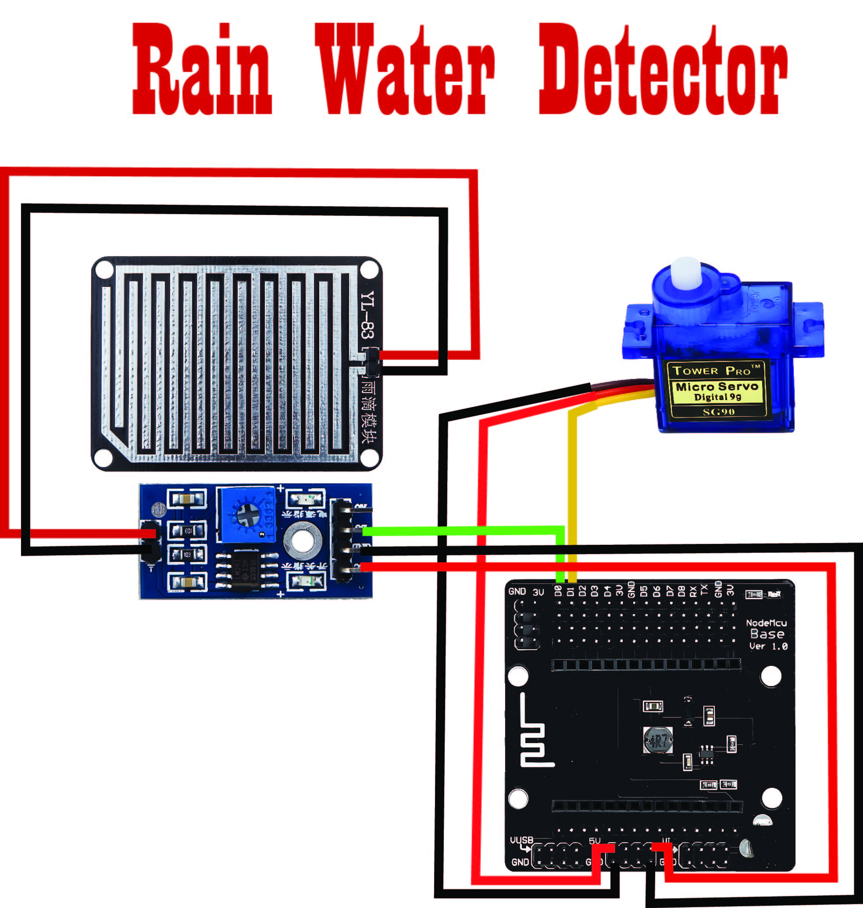

# RainDetectorSystem
Arduino Code for a simple rain detector with servo and ESP8266.
  
Semi-Simulation Game Download Here: https://john-luke-m-codis.itch.io/homeiot  
  
Video Preview: https://youtu.be/0b32Hh_Nm0s?si=pSeyrgbVFGJSYjN8  

  
# Donate Via:  
**Paypal:** http://paypal.me/CodisGames  
**GCash:** __09203563181__  

    

